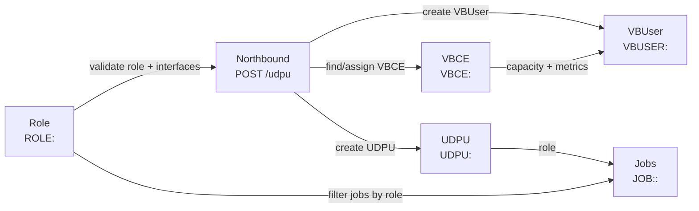
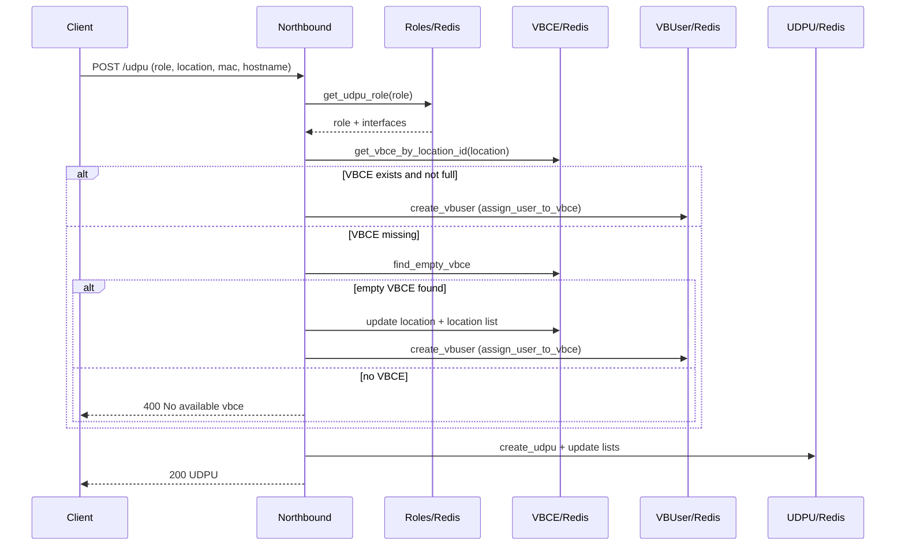

# Взаимодействие roles, VBCE, UDPU (northbound) и jobs

## Контекст и объекты

### Roles (UDPU роли)

- Роли хранятся в Redis как хеши `ROLE:<name>` и содержат описание, флаги `wireguard_tunnel`, `job_control` и структуру `interfaces`.
- Роли используются при создании и обновлении UDPU (northbound) для валидации, а также для определения параметров интерфейсов, которые передаются VBUser.
- При переименовании роли происходит обновление всех UDPU, у которых была старая роль (по ключам `UDPU:<subscriber_uid>`).

### UDPU (northbound)

- Northbound (`POST /udpu`) создаёт UDPU и запускает цепочку выделения VBCE/VBUser.
- UDPU всегда связан с ролью (обязательное поле `role`), роль должна существовать.
- На входе проверяются уникальность `mac_address`, `hostname` и валидность базовых параметров.

### VBCE

- VBCE хранится как `VBCE:<name>`, а также поддерживается набор локаций `vbce_locations_list`.
- При создании UDPU выполняется поиск VBCE по `location_id`; если нет — выбирается свободный VBCE (без `location_id`).
- При привязке VBUser к VBCE увеличивается `current_users`, пересчитывается `available_users`, фиксируются `seed_idx_used`.

### Jobs

- Jobs хранятся как `JOB:<name>:<uid>`, содержат `role` и `frequency`.
- API позволяет получать джобы по роли (`GET /roles/{role_name}/jobs`) — используется фильтрация по полю `role`.
- Фактический запуск/планирование джоб (scheduler) в коде описан на уровне интерфейса, но выполняется за пределами доменной логики jobs.

---

## Основные связи

1. **Roles → UDPU**
   - Northbound при создании/обновлении UDPU валидирует существование роли и использует `interfaces` для параметров VBUser.

2. **UDPU → VBCE → VBUser**
   - UDPU создаётся в northbound, после чего создаётся VBUser и привязывается к VBCE по локации.
   - VBCE хранит загрузку/ёмкость и пересчитывает метрики на периодическом шедулере.

3. **Roles → Jobs**
   - Jobs содержат поле `role`, по которому можно получить список джоб и использовать при запуске/триггере.
   - Логика фильтрации по роли — в `JobRepository.get_by_role`.

---

## Потоки (flows)

### 1) Создание роли

1. Клиент отправляет `POST /roles` с описанием роли.
2. Роль сохраняется как `ROLE:<name>` (flat mapping).
3. Роль становится доступной для northbound и jobs.

### 2) Регистрация UDPU (northbound) с ролью и VBCE

1. Клиент отправляет `POST /udpu` с `role`, `location`, `mac_address`, `hostname`.
2. Northbound валидирует роль, уникальность MAC/hostname.
3. Northbound извлекает `interfaces` из роли, формирует параметры для VBUser.
4. Проверяется VBCE по `location`:
   - Если VBCE существует и не переполнен — создаётся VBUser и обновляется VBCE.
   - Если VBCE нет — берётся свободный VBCE, ему назначается `location`, создаётся VBUser.
   - Если свободного VBCE нет — возвращается ошибка.
5. Создаётся UDPU и обновляются списки `mac_address_list`, `hostname_list`, `location_list`.

### 3) Обновление роли

1. Клиент отправляет `PATCH /roles/{name}`.
2. Роль обновляется в Redis.
3. Если имя роли изменилось — все UDPU с прежним `role` получают новое значение.

### 4) Получение jobs по роли

1. Клиент вызывает `GET /roles/{role_name}/jobs`.
2. Репозиторий джоб фильтрует все jobs по `role` и `frequency`.
3. Возвращается список джоб, привязанных к роли.

---

## Диаграммы

### Диаграмма взаимодействий (упрощённо)

### Диаграмма последовательностей (UDPU onboarding)

---

## Ошибки, потенциальные узкие места и места падения

### 1) Потенциальная потеря целостности между ролями и jobs

- При переименовании роли обновляются только UDPU, но jobs и очереди jobs не обновляются.
- В результате jobs остаются привязанными к устаревшему имени роли, что ведёт к пустым выборкам и «потерянным» задачам по новой роли.

### 2) Конкурентные гонки при распределении VBCE

- В northbound проверка `current_users < max_users` и последующее увеличение `current_users` выполняются в разных шагах без транзакции.
- При параллельной регистрации нескольких UDPU возможно переполнение VBCE сверх лимита.

### 3) Неполные/слабые гарантии целостности UDPU ↔ VBUser

- Сначала создаётся VBUser и обновляется VBCE, затем создаётся UDPU.
- При сбое после создания VBUser возможно состояние «VBUser без UDPU» без автоматического отката.

### 4) Неустойчивая схема `interfaces` в роли

- Northbound ожидает структуру `interfaces.ghn_ports.port_1`, но есть fallback на список. Ошибки глушатся, а значения интерфейсов становятся пустыми строками.
- Это может привести к созданию VBUser с некорректными интерфейсами и дальнейшим сбоям в конфигурации.

### 5) Масштабируемость Redis-запросов

- В `get_vbce_list`, `get_vbce_by_location_id`, `find_empty_vbce`, `get_vbuser_list` используется `redis.keys`, что блокирует Redis на больших объёмах.
- Аналогично, выборка jobs по роли делает полный проход по ключам (`scan_iter` + фильтрация в памяти).

### 6) Нет валидации роли при создании jobs

- Jobs не проверяют наличие роли в момент создания/обновления.
- Это позволяет создать job с несуществующей ролью, которая никогда не будет подхвачена по корректной роли UDPU.

---

## Рекомендации (на будущее)

1. Добавить валидацию роли при создании/обновлении jobs.
2. При переименовании роли обновлять также jobs и job queues.
3. Перевести критичные операции на транзакции Redis (pipeline/transactions) для VBCE/UDPU/VBUser.
4. Заменить `redis.keys` на `scan_iter` или отдельные индексы.
5. Жёстко нормализовать схему `interfaces` в роли и валидировать её при создании/обновлении.
