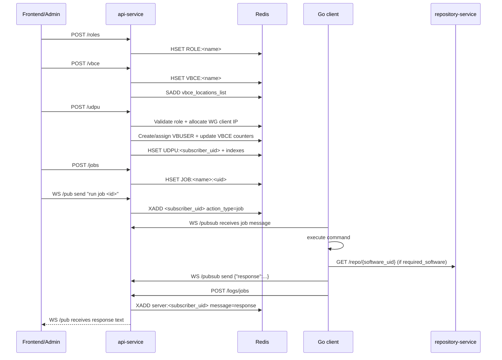
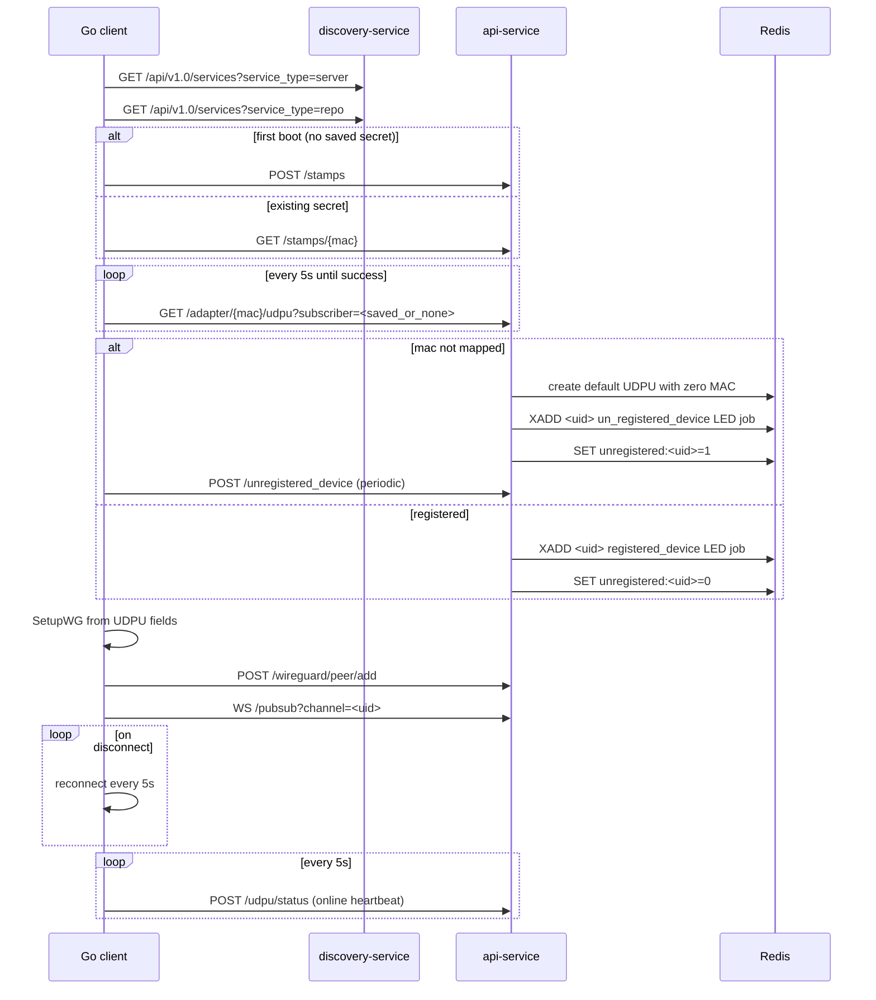

# mUDPU System Technical Investigation

## 1. Scope и ограничения анализа

### 1.1. Фактический scope

Анализ выполнен по всему доступному workspace:

- `api-service/app/domain/api/{roles,vbce,vbuser,northbound,jobs,jobs/queues,websocket,authentication,logs}`
- `api-service/app/main.py`
- `udpu-client-golang/{client.go,rest,ws,process,event,jobs,global,wg}`
- `repository-service`
- Дополнительно для call-sites и bootstrap-контекста: `frontend/app.py`, `discovery-service`

Подтверждение подключения роутеров и общего префикса API:

- `api-service/app/main.py:53`
- `api-service/app/domain/api/__init__.py:14`

### 1.2. Обязательный repo-wide поиск (выполнен)

Repo-wide поиск выполнен по контрактным маркерам:

- endpoint-ы, `action_type`, `run job/run queue`, `subscriber_uid`, `role`, `vbce`, `vbuser`, `udpu`, Redis key patterns, `required_software`, WebSocket paths.

Основные подтверждения зон поиска:

- `api-service/app/domain/api/websocket/view.py:130`
- `api-service/app/domain/api/northbound/view.py:232`
- `udpu-client-golang/process/process.go:22`
- `udpu-client-golang/event/event.go:132`
- `repository-service/app/domain/api/repository/view.py:42`

### 1.3. Ограничения

- Анализ статический, без runtime-запуска сервисов и без live Redis state.
- Интеграционные эффекты (гонки, порядок сообщений, конкуренция) оценены по коду, а не по стендовым трассам.
- Если факт нельзя вывести из кода, он отмечен как **«не подтверждено»**.

## 2. Архитектурная схема взаимодействий

### 2.1. Компоненты

- `api-service` (FastAPI + Redis) управляет доменами UDPU/VBCE/VBUser/Role/Job/Queue/Status/Logs и WS-командами.
  - `api-service/app/main.py:53`
  - `api-service/app/services/redis/redis.py:11`
- `udpu-client-golang` делает bootstrap, получает конфиг UDPU, поднимает WireGuard, подключается к WS, выполняет команды, отправляет логи и heartbeat.
  - `udpu-client-golang/client.go:189`
  - `udpu-client-golang/ws/ws.go:20`
  - `udpu-client-golang/global/global.go:67`
- `repository-service` хранит metadata ПО для `required_software`.
  - `repository-service/app/domain/api/repository/view.py:19`
- `discovery-service` даёт discovery endpoint `/services` для выбора `server` и `repo`.
  - `discovery-service/app/domain/api/service/view.py:17`
- `frontend` (Streamlit) вызывает admin API и `/pub` WS для ручного `run job`.
  - `frontend/app.py:242`
  - `frontend/app.py:270`

### 2.2. High-level diagram

```mermaid
flowchart LR
    FE["Frontend (Streamlit)"]
    CL["uDPU Go Client"]
    API["api-service (FastAPI)"]
    REDIS["Redis"]
    REPO["repository-service"]
    DISC["discovery-service"]

    FE -->|REST /api/v1.0/*| API
    FE -->|WS /api/v1.0/pub?channel=uid| API

    CL -->|Discovery /api/v1.0/services| DISC
    API -->|register service_type=server| DISC
    REPO -->|register service_type=repo| DISC

    CL -->|GET /adapter/{mac}/udpu| API
    CL -->|POST /udpu/status| API
    CL -->|POST /logs/jobs| API
    CL -->|WS /api/v1.0/pubsub?channel=uid| API

    API <--> REDIS
    REPO <--> REDIS
    DISC <--> REDIS

    CL -->|GET /api/v1.0/repo/{software_uid}| REPO
```

Код-доказательства:

- Discovery цикла клиента: `udpu-client-golang/client.go:151`, `udpu-client-golang/client.go:154`
- WS клиента: `udpu-client-golang/ws/ws.go:20`
- WS UI (`/pub`): `api-service/app/domain/api/websocket/view.py:104`
- Репозиторий ПО: `udpu-client-golang/event/event.go:101`, `repository-service/app/domain/api/repository/view.py:42`

## 3. Таблица API endpoint-ов

Все endpoint-ы `api-service` имеют префикс `/api/v1.0`:

- `api-service/app/main.py:53`

### 3.1. API-service HTTP endpoints

| Method | Path | Producer / Consumer | Payload | Response | Ошибки (из кода) | Доказательства |
|---|---|---|---|---|---|---|
| GET | `/health` | Producer: api-service; Consumer: discovery-client probe | - | `{"status":"success"}` | - | `api-service/app/domain/api/health_check/view.py:9` |
| POST | `/stamps` | Producer: authentication; Consumer: Go client first boot | `Stamp{mac_address, body}` | `201`, `{"message":"Stamp created"}` | `403` duplicate stamp | `api-service/app/domain/api/authentication/view.py:17`, `udpu-client-golang/client.go:169` |
| GET | `/stamps` | Producer: authentication; Consumer: не подтверждено (в коде клиента не найден) | - | `List[Stamp]` | - | `api-service/app/domain/api/authentication/view.py:38` |
| GET | `/stamps/{mac_address}` | Producer: authentication; Consumer: Go client с существующим секретом | - | `Stamp` | `404` | `api-service/app/domain/api/authentication/view.py:49`, `udpu-client-golang/client.go:175` |
| DELETE | `/stamps/{mac_address}` | Producer: authentication; Consumer: не подтверждено | - | `200` + message | `404` | `api-service/app/domain/api/authentication/view.py:66` |
| POST | `/roles` | Producer: roles; Consumer: frontend | `UdpuRole` | role dict | `400` exists, `500` Redis | `api-service/app/domain/api/roles/view.py:29`, `frontend/app.py:761` |
| GET | `/roles/{name}` | Producer: roles; Consumer: frontend | - | role dict | `404`, `500` | `api-service/app/domain/api/roles/view.py:57`, `frontend/app.py:277` |
| GET | `/roles` | Producer: roles; Consumer: frontend | - | list roles | `500` | `api-service/app/domain/api/roles/view.py:78`, `frontend/app.py:270` |
| PATCH | `/roles/{name}` | Producer: roles; Consumer: frontend | `UdpuRoleUpdate` | updated role | `404`, `500` | `api-service/app/domain/api/roles/view.py:93`, `frontend/app.py:755` |
| POST | `/roles/clone` | Producer: roles; Consumer: frontend | `UdpuRoleClone{name,new_role_name}` | cloned role | `404` source, `400` target exists, `500` | `api-service/app/domain/api/roles/view.py:114`, `frontend/app.py:480` |
| DELETE | `/roles/{name}` | Producer: roles; Consumer: frontend | - | message | `404`, `500` | `api-service/app/domain/api/roles/view.py:150`, `frontend/app.py:454` |
| POST | `/vbce` | Producer: vbce; Consumer: frontend | `Vbce` | created vbce dict | `400` duplicate, `500` | `api-service/app/domain/api/vbce/view.py:21`, `frontend/app.py:1001` |
| GET | `/vbce/{vbce_name}` | Producer: vbce; Consumer: frontend | - | vbce dict | `404`, `500` | `api-service/app/domain/api/vbce/view.py:44`, `frontend/app.py:295` |
| PATCH | `/vbce/{vbce_name}` | Producer: vbce; Consumer: frontend | `VbceUpdate` | updated vbce | `404`, `400`, `500` | `api-service/app/domain/api/vbce/view.py:56`, `frontend/app.py:989` |
| DELETE | `/vbce/{vbce_name}` | Producer: vbce; Consumer: frontend | - | delete message | `404`, `500` | `api-service/app/domain/api/vbce/view.py:85`, `frontend/app.py:504` |
| GET | `/vbces` | Producer: vbce; Consumer: frontend | - | list vbce | - | `api-service/app/domain/api/vbce/view.py:107`, `frontend/app.py:281` |
| GET | `/vbce/locations` | Producer: vbce; Consumer: frontend | - | list location ids | - | `api-service/app/domain/api/vbce/view.py:112`, `frontend/app.py:288` |
| GET | `/vbuser/{vb_uid}` | Producer: vbuser; Consumer: frontend | - | vbuser (+role interfaces) | `400` not found | `api-service/app/domain/api/vbuser/view.py:19` |
| PATCH | `/vbuser/{vbu_uid}` | Producer: vbuser; Consumer: Go client job callbacks (`update_ep/update_dm/...`) | untyped body | updated vbuser | `404`, `500` | `api-service/app/domain/api/vbuser/view.py:32`, `udpu-client-golang/event/event.go:56` |
| GET | `/vbusers` | Producer: vbuser; Consumer: frontend (не подтверждено прямой call-site) | - | list vbusers | - | `api-service/app/domain/api/vbuser/view.py:52` |
| POST | `/udpu` | Producer: northbound; Consumer: frontend/manual provisioning | `Udpu` | `200` udpu object | `400` validation/business rules, `500` | `api-service/app/domain/api/northbound/view.py:52`, `frontend/app.py:1309` |
| GET | `/udpu/locations` | Producer: northbound | - | list locations | `500` | `api-service/app/domain/api/northbound/view.py:159`, `frontend/app.py:299` |
| GET | `/{location_id}/udpu_list` | Producer: northbound | - | list udpu in location | `404`, `500` | `api-service/app/domain/api/northbound/view.py:168`, `frontend/app.py:306` |
| PUT | `/udpu_bulk/{location_id}` | Producer: northbound | `UdpuUpdate` | list updated udpu | `404`, `400`, `500` | `api-service/app/domain/api/northbound/view.py:190`, `frontend/app.py:331` |
| GET | `/subscriber/{subscriber_uid}/udpu` | Producer: northbound; Consumer: Go client fallback poll by uid, frontend | - | udpu object | `404`, `500` | `api-service/app/domain/api/northbound/view.py:219`, `udpu-client-golang/rest/rest.go:223`, `frontend/app.py:313` |
| GET | `/adapter/{mac_address}/udpu` | Producer: northbound; Consumer: Go client bootstrap, frontend | query `subscriber` optional | udpu object (или default/unregistered flow) | `400`, `500` | `api-service/app/domain/api/northbound/view.py:232`, `udpu-client-golang/rest/rest.go:191`, `frontend/app.py:327` |
| PUT | `/subscriber/{subscriber_uid}/udpu` | Producer: northbound; Consumer: frontend | `UdpuUpdate` | updated udpu | `404`, `400`, `500` | `api-service/app/domain/api/northbound/view.py:293`, `frontend/app.py:1303` |
| PUT | `/adapter/{mac_address}/udpu` | Producer: northbound; Consumer: frontend (не подтверждено прямой call-site) | `Udpu` | updated udpu | `404`, `400`, `500` | `api-service/app/domain/api/northbound/view.py:366` |
| DELETE | `/subscriber/{subscriber_uid}/udpu` | Producer: northbound; Consumer: frontend | - | delete message | `404`, `500` | `api-service/app/domain/api/northbound/view.py:430`, `frontend/app.py:526` |
| DELETE | `/adapter/{mac_address}/udpu` | Producer: northbound; Consumer: frontend | - | delete message | `400`, `404`, `500` | `api-service/app/domain/api/northbound/view.py:451`, `frontend/app.py:334` |
| POST | `/unregistered_device` | Producer: northbound; Consumer: Go client periodic sender, frontend | `UnregisteredDevice` | message | - | `api-service/app/domain/api/northbound/view.py:480`, `udpu-client-golang/rest/rest.go:113`, `frontend/app.py:337` |
| GET | `/unregistered_devices` | Producer: northbound; Consumer: frontend | - | list devices | - | `api-service/app/domain/api/northbound/view.py:492`, `frontend/app.py:341` |
| GET | `/udpu/{subscriber_uid}/status` | Producer: northbound status | - | `{state,status}` | `404`, `502` | `api-service/app/domain/api/northbound/view.py:501`, `frontend/app.py:323` |
| POST | `/udpu/status` | Producer: northbound status; Consumer: Go client heartbeat | `UdpuStatus{subscriber_uid,state,status,created_at}` | `UdpuStatus` | `502` Redis, возможен runtime key error | `api-service/app/domain/api/northbound/view.py:512`, `udpu-client-golang/rest/rest.go:84` |
| GET | `/udpu/status` | Producer: northbound status; Consumer: frontend | - | list statuses | `500` | `api-service/app/domain/api/northbound/view.py:534`, `frontend/app.py:316` |
| GET | `/jobs` | Producer: jobs; Consumer: frontend | query `name` optional | list jobs | `404` by filter | `api-service/app/domain/api/jobs/view.py:18`, `frontend/app.py:348` |
| POST | `/jobs` | Producer: jobs; Consumer: frontend | `JobSchema` | `JobSchema` | `409` duplicate | `api-service/app/domain/api/jobs/view.py:30`, `frontend/app.py:1845` |
| GET | `/jobs/{identifier}` | Producer: jobs; Consumer: frontend | - | `JobSchema` | `404` | `api-service/app/domain/api/jobs/view.py:39`, `frontend/app.py:355` |
| PATCH | `/jobs/{identifier}` | Producer: jobs; Consumer: frontend | `JobSchemaUpdate` | `JobSchema` | `404` | `api-service/app/domain/api/jobs/view.py:49`, `frontend/app.py:1839` |
| DELETE | `/jobs/{identifier}` | Producer: jobs; Consumer: frontend | - | message | `404` | `api-service/app/domain/api/jobs/view.py:60`, `frontend/app.py:547` |
| GET | `/roles/{role_name}/jobs` | Producer: jobs; Consumer: Go client first boot | query `frequency` optional (default first_boot) | list jobs | `404` no jobs | `api-service/app/domain/api/jobs/view.py:69`, `udpu-client-golang/process/process.go:73` |
| GET | `/jobs/frequency/{frequency}` | Producer: jobs; Consumer: Go client regular boot | path enum | list jobs | `404` | `api-service/app/domain/api/jobs/view.py:84`, `udpu-client-golang/process/process.go:83` |
| GET | `/queues` | Producer: queues; Consumer: не подтверждено | - | list queues | `404` if empty | `api-service/app/domain/api/jobs/queues/view.py:30` |
| POST | `/queues` | Producer: queues; Consumer: не подтверждено | `JobQueueSchema` | `JobQueueSchema` | `400` + runtime risks (см. раздел 8) | `api-service/app/domain/api/jobs/queues/view.py:40` |
| GET | `/queues/{identifier}` | Producer: queues | - | `JobQueueSchema` | `404` | `api-service/app/domain/api/jobs/queues/view.py:52` |
| PATCH | `/queues/{identifier}` | Producer: queues | `JobQueueSchema` | `JobQueueSchema` | `404`, `400` + runtime risks | `api-service/app/domain/api/jobs/queues/view.py:62` |
| DELETE | `/queues/{identifier}` | Producer: queues | - | message | `404` | `api-service/app/domain/api/jobs/queues/view.py:76` |
| GET | `/roles/{role_name}/queues` | Producer: queues | - | list queues | `404` + runtime risks | `api-service/app/domain/api/jobs/queues/view.py:87` |
| GET | `/logs/jobs` | Producer: logs; Consumer: frontend | - | `List[JobLogSchema]` | - | `api-service/app/domain/api/logs/view.py:21`, `frontend/app.py:359` |
| POST | `/logs/jobs` | Producer: logs; Consumer: Go client job executor | `JobLogSchema` | `201`, created log | runtime/Redis errors | `api-service/app/domain/api/logs/view.py:31`, `udpu-client-golang/global/global.go:67` |
| GET | `/logs/jobs/{job_name}` | Producer: logs; Consumer: frontend | - | `List[JobLogSchema]` | - | `api-service/app/domain/api/logs/view.py:42`, `frontend/app.py:366` |
| GET | `/wireguard/status` | Producer: wireguard; Consumer: не подтверждено | - | `InterfaceStatus` | `400` when command fails | `api-service/app/domain/api/wireguard/view.py:30` |
| POST | `/wireguard/up` | Producer: wireguard | - | message | `400` if already up | `api-service/app/domain/api/wireguard/view.py:36` |
| POST | `/wireguard/down` | Producer: wireguard | - | message | `400` if already down | `api-service/app/domain/api/wireguard/view.py:44` |
| GET | `/wireguard/peers` | Producer: wireguard | - | peer map | `400` on failure | `api-service/app/domain/api/wireguard/view.py:56` |
| POST | `/wireguard/peer/add` | Producer: wireguard; Consumer: Go client WG setup | `Peer{public_key,allowed_ips,...}` | message | `400` | `api-service/app/domain/api/wireguard/view.py:67`, `udpu-client-golang/wg/wg.go:154` |
| POST | `/wireguard/peer/remove` | Producer: wireguard | `PeerRemove{public_key}` | message | `400` | `api-service/app/domain/api/wireguard/view.py:81` |

### 3.2. Repository-service endpoints (dependency для `required_software`)

| Method | Path | Producer / Consumer | Payload | Response | Ошибки | Доказательства |
|---|---|---|---|---|---|---|
| GET | `/api/v1.0/health` | Producer: repository-service; Consumer: infra probes | - | `{"status":"success"}` | - | `repository-service/app/domain/api/health_check/view.py:9` |
| POST | `/api/v1.0/repo` | Producer: repository-service; Consumer: не подтверждено | `Repository` | `Repository` | `400` exists, `404` checksum/file not found | `repository-service/app/domain/api/repository/view.py:19` |
| GET | `/api/v1.0/repo/{software_uid}` | Producer: repository-service; Consumer: Go client required_software resolver | - | `Repository` (+downloads++) | `404` | `repository-service/app/domain/api/repository/view.py:42`, `udpu-client-golang/event/event.go:101` |
| PATCH | `/api/v1.0/repo/{software_uid}` | Producer: repository-service | `Repository` partial | updated `Repository` | `404` | `repository-service/app/domain/api/repository/view.py:56` |
| DELETE | `/api/v1.0/repo/{software_uid}` | Producer: repository-service | - | mock message | - | `repository-service/app/domain/api/repository/view.py:70` |

### 3.3. Discovery-service endpoints (bootstrap dependency)

| Method | Path | Producer / Consumer | Payload | Response | Ошибки | Доказательства |
|---|---|---|---|---|---|---|
| GET | `/api/v1.0/health` | Producer: discovery-service; Consumer: Go client latency probe | - | `{"status":"success"}` | - | `discovery-service/app/domain/api/health_check/view.py:9`, `udpu-client-golang/discovery/discovery.go:84` |
| GET | `/api/v1.0/services?service_type=...` | Producer: discovery-service; Consumer: Go client, service discovery logic | query `service_type` | list service records | - | `discovery-service/app/domain/api/service/view.py:17`, `udpu-client-golang/discovery/discovery.go:27` |
| POST | `/api/v1.0/services` | Producer: discovery-service; Consumer: api-service/repository-service periodic registration | `ServiceDiscoverySchema` | stored object | - | `discovery-service/app/domain/api/service/view.py:22`, `api-service/app/services/discovery/register.py:10`, `repository-service/app/services/discovery/register.py:7` |

## 4. Протокол WebSocket

### 4.1. Endpoint-ы

- `WS /api/v1.0/pubsub?channel=<subscriber_uid>`: канал клиента (agent-facing).
  - `api-service/app/domain/api/websocket/view.py:28`
  - `udpu-client-golang/ws/ws.go:20`
- `WS /api/v1.0/pub?channel=<subscriber_uid>`: канал UI/admin.
  - `api-service/app/domain/api/websocket/view.py:104`
  - `frontend/app.py:242`

### 4.2. Stream model в Redis

- Client stream: `<channel>` — команды для клиента (`action_type=job|queue`).
  - `api-service/app/domain/api/websocket/view.py:125`
- Server stream: `server:<channel>` — ответы/сообщения от клиента к UI.
  - `api-service/app/domain/api/websocket/view.py:72`

### 4.3. Команды и форматы

| Направление | Транспорт | Формат | Поведение | Доказательства |
|---|---|---|---|---|
| UI -> api-service `/pub` | WS text | `run job <identifier>` | backend загружает job и пушит в stream `<channel>` JSON c `action_type=job` + `command/frequency/require_output/name/locked/required_software/type/vbuser_id` | `api-service/app/domain/api/websocket/view.py:154`, `api-service/app/domain/api/websocket/view.py:179` |
| UI -> api-service `/pub` | WS text | `run queue <identifier>` | backend загружает queue и пушит `action_type=queue` + `jobs/locked` | `api-service/app/domain/api/websocket/view.py:130`, `api-service/app/domain/api/websocket/view.py:143` |
| UI -> api-service `/pub` | WS text | `run job status` | backend читает `STATUS:<subscriber_uid>` и отправляет `{state,status}` в тот же WS | `api-service/app/domain/api/websocket/view.py:155`, `api-service/app/domain/api/websocket/view.py:158` |
| api-service -> client `/pubsub` | WS JSON | Redis stream entry | клиент получает JSON и роутит по `action_type` | `api-service/app/domain/api/websocket/view.py:51`, `udpu-client-golang/process/process.go:22` |
| client -> api-service `/pubsub` | WS text | free text (обычно JSON строка) | backend пишет `{"message": text}` в `server:<channel>` | `api-service/app/domain/api/websocket/view.py:75`, `api-service/app/domain/api/websocket/view.py:82` |
| api-service -> UI `/pub` | WS text | `message` from `server:<channel>` | backend читает `server:<channel>`, отправляет в UI, удаляет stream entry | `api-service/app/domain/api/websocket/view.py:204`, `api-service/app/domain/api/websocket/view.py:213` |

### 4.4. Клиентское выполнение

- Клиент обрабатывает только `action_type=job|queue`.
  - `udpu-client-golang/process/process.go:29`
- `job`: запуск shell-команды, опциональный update VBUser, отправка `{"response": ...}` при `require_output=true`, отправка JobLog через HTTP.
  - `udpu-client-golang/event/event.go:43`
  - `udpu-client-golang/event/event.go:173`
  - `udpu-client-golang/global/global.go:67`
- `queue`: запрашивает список jobs и выполняет их.
  - `udpu-client-golang/event/event.go:193`

## 5. Redis data model

TTL/expiry по ключам в коде **не используется** (`expire`, `ttl`, `setex` отсутствуют).

- Проверка: repo-wide поиск по `expire/ttl/setex` в сервисах.

| Key pattern | Type | Кто пишет | Кто читает | TTL | Инварианты / ограничения | Доказательства |
|---|---|---|---|---|---|---|
| `STAMP:<mac>` | string | authentication `create` | authentication `get/list/delete`, Go client stamp check | нет | уникальность по exact key | `api-service/app/domain/api/authentication/core.py:41`, `api-service/app/domain/api/authentication/core.py:57` |
| `ROLE:<name>` | hash | roles create/update/clone | roles get/list, northbound role validation, jobs role filter | нет | при rename пытается каскадно обновить UDPU/Jobs/Queues | `api-service/app/domain/api/roles/dependencies.py:78`, `api-service/app/domain/api/roles/dependencies.py:132` |
| `VBCE:<name>` | hash | vbce create/patch/update_vbce | vbce list/get, northbound assign, vbuser delete flow | нет | хранит capacity + `seed_idx_used` | `api-service/app/domain/api/vbce/dependencies.py:73`, `api-service/app/domain/api/vbce/dependencies.py:137` |
| `vbce_locations_list` | set | vbce create/patch/update_vbce | vbce locations, vbuser `location_exist` | нет | location registry | `api-service/app/domain/api/vbce/dependencies.py:16`, `api-service/app/domain/api/vbuser/dependencies.py:18` |
| `<location_id>` | string | vbce create/patch/update_vbce | vbuser delete (map location -> vbce_name) | нет | key без префикса, риск коллизий | `api-service/app/domain/api/vbce/dependencies.py:74`, `api-service/app/domain/api/vbuser/dependencies.py:79` |
| `VBUSER:<vb_uid>` | hash | vbuser create/assign/update interfaces | vbuser get/list/by_udpu/by_location | нет | `vb_uid` = uuid5(udpu+ghn_interface) | `api-service/app/domain/api/vbuser/schemas.py:59`, `api-service/app/domain/api/vbuser/dependencies.py:137` |
| `UDPU:<subscriber_uid>` | hash | northbound post/update, get_by_mac fallback create | northbound get/delete/status, client bootstrap | нет | основной профиль устройства | `api-service/app/domain/api/northbound/view.py:144`, `api-service/app/domain/api/northbound/dependencies.py:79` |
| `MA:<mac>` | string | northbound post/update | northbound `get_udpu_by_mac_address` (частично), но фактически поиск чаще scan по hash | нет | mapping MAC -> `UDPU:<uid>` | `api-service/app/domain/api/northbound/dependencies.py:107`, `api-service/app/domain/api/northbound/dependencies.py:180` |
| `UDPU:mac_address_list` | set | northbound post/update/delete | uniqueness checks | нет | unique MAC index | `api-service/app/domain/api/northbound/view.py:145`, `api-service/app/domain/api/northbound/dependencies.py:32` |
| `UDPU:hostname_list` | set | northbound post/delete | uniqueness checks | нет | unique hostname index | `api-service/app/domain/api/northbound/view.py:146`, `api-service/app/domain/api/northbound/dependencies.py:36` |
| `UDPU:location_list` | set | northbound post/update | list location ids | нет | location catalog | `api-service/app/domain/api/northbound/view.py:147`, `api-service/app/domain/api/northbound/dependencies.py:57` |
| `udpu_location:<location_id>` | set | northbound post/update | get subscribers by location | нет | members=subscriber_uid | `api-service/app/domain/api/northbound/view.py:148`, `api-service/app/domain/api/northbound/dependencies.py:65` |
| `STATUS:<subscriber_uid>` | hash | `POST /udpu/status` | status GET/list + stale offline check | нет | stale >10s => forced offline | `api-service/app/domain/api/northbound/dependencies.py:308`, `api-service/app/domain/api/northbound/dependencies.py:389` |
| `unregistered:<subscriber_uid>` | string (`0/1`) | northbound `GET /adapter/{mac}/udpu` | косвенно (не через API-typed parse) | нет | flag registered/unregistered | `api-service/app/domain/api/northbound/view.py:269`, `api-service/app/domain/api/northbound/view.py:279` |
| `unregistered:<ip_address>` | hash | `POST /unregistered_device` | `GET /unregistered_devices` | нет | смешан с предыдущим паттерном по одному префиксу | `api-service/app/domain/api/northbound/view.py:483`, `api-service/app/domain/api/northbound/view.py:496` |
| `<subscriber_uid>` | stream | northbound LED events, websocket `/pub` commands | websocket `/pubsub` deliver -> Go client | maxlen varies | stream команд клиента | `api-service/app/domain/api/northbound/view.py:259`, `api-service/app/domain/api/websocket/view.py:140` |
| `server:<subscriber_uid>` | stream | websocket `/pubsub` receive (от клиента) | websocket `/pub` subscriber (UI) | `maxlen=1` на записи клиента | только последнее сообщение клиента сохраняется | `api-service/app/domain/api/websocket/view.py:80`, `api-service/app/domain/api/websocket/view.py:204` |
| `JOB:<name>:<uid>` | hash | jobs create/update | jobs get/list/filter, websocket run job | нет | uid = uuid5(name) | `api-service/app/domain/api/jobs/schemas.py:70`, `api-service/app/domain/api/jobs/core.py:41` |
| `QUEUE:<name>:<uid>` | hash | queue repository core | queue API core get/list/delete, role rename updater | нет | текущий формат queue key | `api-service/app/domain/api/jobs/queues/schemas.py:19`, `api-service/app/domain/api/jobs/queues/core.py:35` |
| `QUEUE_<uid or key>` | hash (legacy) | legacy queue dependencies | websocket run queue path | нет | legacy/несовместимый формат | `api-service/app/domain/api/jobs/queues/dependencies.py:78`, `api-service/app/domain/api/websocket/view.py:133` |
| `JOB:LOGS:<client>:<job>:<ts>` | hash | Go client via `POST /logs/jobs` | logs API list/get_by_name | нет | immutable-like append model | `api-service/app/domain/api/logs/schemas.py:26`, `udpu-client-golang/global/global.go:104` |
| `udpu:wg:free:client:ips` | set | northbound WG IP pool init | northbound generate_client_ip | нет | free WG client IP pool | `api-service/app/settings/base.py:58`, `api-service/app/domain/api/northbound/dependencies.py:248` |
| `udpu:wg:allocated:client:ips` | set | northbound generate_client_ip | northbound generate_client_ip | нет | allocated WG client IP pool | `api-service/app/settings/base.py:59`, `api-service/app/domain/api/northbound/dependencies.py:252` |
| `SERVICE_REPOSITORY_<software_uid>` | hash | repository-service create/patch | repository-service get + client required_software resolution | нет | metadata для download URL | `repository-service/app/domain/api/repository/schemas.py:27`, `repository-service/app/domain/api/repository/dependencies.py:19` |
| `SERVICE_DISCOVERY_<service_type>_<host>_<port>` | hash | discovery-service create | discovery-service list | нет | service registry | `discovery-service/app/domain/api/service/schemas.py:13`, `discovery-service/app/domain/api/service/dependencies.py:40` |
| `wireguard:server:public:key`, `wireguard:server:private:key`, `WG:STATUS` | (константы) | **не подтверждено фактическое использование** | **не подтверждено** | - | только декларация констант | `api-service/app/domain/api/wireguard/constants.py:1` |

## 6. Entity relationship matrix

| A -> B | Тип связи | Кто создает/обновляет/удаляет | Redis/контракт | Код-доказательство |
|---|---|---|---|---|
| Role -> UDPU | `UDPU.role` reference | create/update UDPU в northbound; rename role каскадно правит UDPU | `UDPU:<uid>.role` | `api-service/app/domain/api/northbound/view.py:83`, `api-service/app/domain/api/roles/dependencies.py:143` |
| Role -> VBUser | role.interfaces -> VBUser ghn/lcmp interfaces | northbound при create/update UDPU | `VBUSER:<vb_uid>.ghn_interface/lcmp_interface` | `api-service/app/domain/api/roles/dependencies.py:39`, `api-service/app/domain/api/northbound/view.py:344` |
| Role -> Job | `JOB.role` | Job CRUD; role rename каскадно обновляет jobs | `JOB:<name>:<uid>.role` | `api-service/app/domain/api/jobs/schemas.py:48`, `api-service/app/domain/api/roles/dependencies.py:49` |
| Role -> Queue | `QUEUE.role` | queue CRUD; role rename каскадно обновляет queues | `QUEUE:* role field` | `api-service/app/domain/api/jobs/queues/schemas.py:12`, `api-service/app/domain/api/roles/dependencies.py:56` |
| VBCE -> VBUser | capacity/container relation by location | create_vbuser->assign_user_to_vbce increments current_users | `VBCE:<name>.current_users/seed_idx_used`, `VBUSER.location_id` | `api-service/app/domain/api/vbuser/dependencies.py:141`, `api-service/app/domain/api/vbce/dependencies.py:137` |
| UDPU -> VBUser | one subscriber to one active vbuser context | northbound create/update/delete flows create/delete vbuser | `VBUSER.udpu = subscriber_uid` | `api-service/app/domain/api/northbound/view.py:347`, `api-service/app/domain/api/vbuser/dependencies.py:47` |
| UDPU -> UdpuStatus | heartbeat/status relation | Go client posts status; northbound stores hash `STATUS:<uid>` | `STATUS:<subscriber_uid>` | `udpu-client-golang/rest/rest.go:77`, `api-service/app/domain/api/northbound/dependencies.py:351` |
| Job -> Queue | queue stores list of job identifiers | queue schema field `queue`, websocket run queue dispatch | `QUEUE:* .queue` | `api-service/app/domain/api/jobs/queues/schemas.py:11`, `api-service/app/domain/api/websocket/view.py:145` |
| Job -> JobLog | execution emits stdout/stderr log | Go client executes command and POSTs log | `JOB:LOGS:<client>:<job>:<ts>` | `udpu-client-golang/global/global.go:148`, `api-service/app/domain/api/logs/schemas.py:26` |
| Job -> Repository Software | `required_software` software_uid list | websocket emits `required_software`; client resolves via repository-service | `/api/v1.0/repo/{software_uid}` | `api-service/app/domain/api/websocket/view.py:185`, `udpu-client-golang/event/event.go:101` |
| Stamp -> UDPU bootstrap | stamp validates device identity before provisioning pull | client POST/GET stamp before `GET /adapter/{mac}/udpu` | `STAMP:<mac>` + bootstrap flow | `udpu-client-golang/client.go:169`, `udpu-client-golang/client.go:189` |
| UDPU -> WireGuard Peer | UDPU config used to configure tunnel and register peer on server | northbound sets WG fields; client posts peer/add | `/wireguard/peer/add` | `api-service/app/domain/api/northbound/view.py:65`, `udpu-client-golang/wg/wg.go:154` |

## 7. End-to-end сценарии

### 7.1. Сценарий: Role -> VBCE -> UDPU -> VBUser -> Job/Queue -> WS execution -> response/logs



Подтверждение ключевых шагов:

- Role create: `api-service/app/domain/api/roles/view.py:29`
- VBCE create: `api-service/app/domain/api/vbce/view.py:21`
- UDPU create + VBUser auto-create: `api-service/app/domain/api/northbound/view.py:52`, `api-service/app/domain/api/northbound/view.py:111`
- Job create: `api-service/app/domain/api/jobs/view.py:30`
- WS run job dispatch: `api-service/app/domain/api/websocket/view.py:154`, `api-service/app/domain/api/websocket/view.py:176`
- Client execute + response: `udpu-client-golang/event/event.go:165`, `udpu-client-golang/event/event.go:187`
- Client logs: `udpu-client-golang/global/global.go:67`

### 7.2. Client bootstrap (discovery, stamp, adapter, fallback, WG, WS reconnect, heartbeat)



Подтверждение:

- discovery + service selection: `udpu-client-golang/client.go:151`, `udpu-client-golang/discovery/discovery.go:27`
- stamp flow: `udpu-client-golang/client.go:169`, `udpu-client-golang/client.go:175`
- adapter pull: `udpu-client-golang/rest/rest.go:191`
- fallback unregistered branch в backend: `api-service/app/domain/api/northbound/view.py:245`, `api-service/app/domain/api/northbound/view.py:259`
- unregistered sender в клиенте: `udpu-client-golang/client.go:261`, `udpu-client-golang/rest/rest.go:113`
- WG setup + peer add: `udpu-client-golang/client.go:235`, `udpu-client-golang/wg/wg.go:154`
- WS reconnect: `udpu-client-golang/client.go:284`, `udpu-client-golang/ws/ws.go:29`
- status heartbeat: `udpu-client-golang/client.go:301`, `udpu-client-golang/rest/rest.go:95`

## 8. Найденные несоответствия / противоречия

### 8.1. Code-level contradictions

| Severity | Проблема | Что расходится | Доказательства |
|---|---|---|---|
| **Critical** | Queue API view вызывает несуществующие методы repo | `is_role_unique`, `validate_jobs`, `get_by_role` отсутствуют в `QueueRepository`; patch вызывает `repo.update(payload)` при сигнатуре `update(identifier, update_data)` | `api-service/app/domain/api/jobs/queues/view.py:45`, `api-service/app/domain/api/jobs/queues/view.py:74`, `api-service/app/domain/api/jobs/queues/core.py:24`, `api-service/app/domain/api/jobs/queues/core.py:74` |
| **Critical** | Queue core использует `.get()` у Pydantic модели | `queue.get("queue", ...)` в `create/update` для `JobQueueSchema` | `api-service/app/domain/api/jobs/queues/core.py:63`, `api-service/app/domain/api/jobs/queues/core.py:79` |
| **High** | Несовместимые key patterns Queue (`:` vs `_`) | REST/core пишет `QUEUE:<name>:<uid>`, websocket/dependencies читает `QUEUE_*` | `api-service/app/domain/api/jobs/queues/schemas.py:19`, `api-service/app/domain/api/jobs/queues/dependencies.py:57`, `api-service/app/domain/api/websocket/view.py:133` |
| **High** | VBCE REST работает с неполными key | `get_vbce` читает key как есть, а view передает `vbce_name` без `VBCE:`; delete тоже без префикса | `api-service/app/domain/api/vbce/dependencies.py:30`, `api-service/app/domain/api/vbce/view.py:48`, `api-service/app/domain/api/vbce/view.py:97` |
| **High** | VBUser PATCH пишет в другой key namespace | update path использует `vbuser_{uid}` и lookup без `VBUSER:` | `api-service/app/domain/api/vbuser/dependencies.py:115`, `api-service/app/domain/api/vbuser/dependencies.py:117`, `api-service/app/domain/api/vbuser/view.py:36` |
| **High** | Queue execution filter не совпадает с API контрактом | клиент отправляет `filter_by`, backend `/jobs` поддерживает только `name` | `udpu-client-golang/global/global.go:297`, `api-service/app/domain/api/jobs/view.py:19` |
| **High** | Regular boot jobs не фильтруются по role | клиент берет `/jobs/frequency/every_boot` глобально | `udpu-client-golang/process/process.go:83`, `api-service/app/domain/api/jobs/core.py:126` |
| **High** | Repository checksum рассчитывается некорректно | `BytesIO` читается без `seek(0)` после записи => checksum фактически для пустого буфера | `repository-service/app/services/utils.py:66`, `repository-service/app/services/utils.py:69` |
| **High** | `PUT /adapter/{mac}/udpu` валидирует новый role, но применяет интерфейсы от старого role | для VBUser берется `udpu_obj["role"]` вместо `update_request.role` | `api-service/app/domain/api/northbound/view.py:372`, `api-service/app/domain/api/northbound/view.py:388`, `api-service/app/domain/api/northbound/view.py:410` |
| **High** | Ошибка отправки job-лога может завершить процесс клиента | в `sendJobLog` используются `logx.Fatalf(...)` | `udpu-client-golang/global/global.go:100`, `udpu-client-golang/global/global.go:114`, `udpu-client-golang/logx/logx.go:38` |
| **Medium** | Смешанные типы `unregistered:*` | string-флаги и hash payload под одним prefix | `api-service/app/domain/api/northbound/view.py:269`, `api-service/app/domain/api/northbound/view.py:483`, `api-service/app/domain/api/northbound/view.py:496` |
| **Medium** | `POST /udpu/status` не проверяет отсутствие UDPU | прямой доступ `udpu["mac_address"]` | `api-service/app/domain/api/northbound/view.py:520`, `api-service/app/domain/api/northbound/view.py:522` |
| **Medium** | Seed index pool фактически не управляется | `get_seed_index` читает `loc_seed_ind_*`, но записи в этот key не найдены; исключения в `get_random_seed_index` по типам | `api-service/app/domain/api/vbuser/dependencies.py:149`, `api-service/app/utils/utils.py:102` |
| **Medium** | При удалении UDPU не очищаются location-индексы | удаляется UDPU/mac/pppoe и sets MAC/hostname, но не `UDPU:location_list` и `udpu_location:<location>` | `api-service/app/domain/api/northbound/dependencies.py:120`, `api-service/app/domain/api/northbound/dependencies.py:127`, `api-service/app/domain/api/northbound/dependencies.py:65` |
| **Low** | Job logs client ожидает 200, сервер возвращает 201 | ложный warning на каждый лог | `udpu-client-golang/global/global.go:119`, `api-service/app/domain/api/logs/view.py:31` |
| **Low** | Stamp key case-normalization inconsistent | schema key lower-case, service key formatter без lower-case | `api-service/app/domain/api/authentication/schemas.py:30`, `api-service/app/domain/api/authentication/core.py:27` |

### 8.2. Documentation vs code contradictions

| Severity | Документация | Код | Доказательства |
|---|---|---|---|
| **High** | README: Northbound via `POST /northbound` | Реально `POST /udpu` | `api-service/README.md:165`, `api-service/app/domain/api/northbound/view.py:52` |
| **High** | README: clone role `POST /roles/{name}/clone` | Реально `POST /roles/clone` | `api-service/README.md:177`, `api-service/app/domain/api/roles/view.py:114` |
| **High** | README: WireGuard `POST /wireguard/peers`/`DELETE /wireguard/peers` | Реально `POST /wireguard/peer/add` / `POST /wireguard/peer/remove` | `api-service/README.md:186`, `api-service/app/domain/api/wireguard/view.py:67`, `api-service/app/domain/api/wireguard/view.py:81` |
| **Medium** | README: stamp TTL | TTL в коде не используется | `api-service/README.md:122`, repo-wide search по `expire/ttl/setex` |
| **Medium** | README: VBCE `POST /vbces` | Реально `POST /vbce` | `api-service/README.md:147`, `api-service/app/domain/api/vbce/view.py:21` |
| **Medium** | README: VBUser включает `POST /vbusers` | POST endpoint отсутствует | `api-service/README.md:158`, `api-service/app/domain/api/vbuser/view.py:19` |
| **Medium** | README: WebSocket на Redis Pub/Sub | Реально Redis Streams (`XADD/XREAD/XDEL`) | `api-service/README.md:199`, `api-service/app/domain/api/websocket/view.py:51`, `api-service/app/domain/api/websocket/view.py:80` |
| **Low** | `md/flow.md`: при rename role не обновляются jobs/queues | В коде каскад на jobs/queues есть | `md/flow.md:136`, `api-service/app/domain/api/roles/dependencies.py:146` |
| **Low** | repository README: регистрация в discovery через `/register` | Код использует `/api/v1.0/services` | `repository-service/README.md:82`, `repository-service/app/settings/base.py:33`, `repository-service/app/services/discovery/register.py:8` |

## 9. Риски эксплуатации (DevOps/production) и наблюдаемость

### 9.1. Эксплуатационные риски

1. **Queue subsystem функционально нестабилен (Critical)**.
   - Риски: невозможность безопасно создавать/обновлять/запускать queue, 500 в runtime.
   - `api-service/app/domain/api/jobs/queues/view.py:45`, `api-service/app/domain/api/jobs/queues/core.py:63`

2. **Нарушение консистентности Redis key-space (High)**.
   - `QUEUE:*` и `QUEUE_*` живут параллельно, часть call-sites не видит другую.
   - `api-service/app/domain/api/jobs/queues/schemas.py:19`, `api-service/app/domain/api/jobs/queues/dependencies.py:57`

3. **Риск некорректной загрузки software metadata (High)**.
   - Некорректный checksum в repository-service.
   - `repository-service/app/services/utils.py:69`

4. **Неконсистентное применение role при `PUT /adapter/{mac}/udpu` (High)**.
   - Валидируется `update_request.role`, но интерфейсы VBUser пересчитываются по старому `udpu_obj[\"role\"]`.
   - `api-service/app/domain/api/northbound/view.py:372`, `api-service/app/domain/api/northbound/view.py:388`, `api-service/app/domain/api/northbound/view.py:410`

5. **Ошибка отправки JobLog может аварийно завершить клиента (High)**.
   - В сетевых сбоях `sendJobLog` использует `Fatalf`, что вызывает `os.Exit(1)`.
   - `udpu-client-golang/global/global.go:100`, `udpu-client-golang/global/global.go:114`, `udpu-client-golang/logx/logx.go:38`

6. **Риск перерасхода/дубликатов scheduled jobs на клиенте (Medium)**.
   - Для каждого `ScheduleJob` создается новый `cron.New()`, без реестра/dedup.
   - `udpu-client-golang/global/global.go:258`

7. **Сильная привилегированность контейнеров (Medium/High)**.
   - `api-service` и client в `privileged`, `NET_ADMIN`, `SYS_MODULE`, доступ к `/dev/net/tun`.
   - `docker-compose.local.yml:51`, `docker-compose.local.yml:86`

8. **Старт при недоступном Redis без fail-fast (Medium)**.
   - connect error логируется, но startup не останавливается.
   - `api-service/app/services/redis/redis.py:20`

9. **Неочищаемые location-индексы при delete UDPU (Medium)**.
   - При удалении UDPU не очищаются `udpu_location:<location>` и `UDPU:location_list`.
   - `api-service/app/domain/api/northbound/dependencies.py:120`, `api-service/app/domain/api/northbound/dependencies.py:127`, `api-service/app/domain/api/northbound/dependencies.py:65`

10. **Host networking в `docker-compose.yml` (операционные коллизии) (Medium)**.
   - все сервисы на host network, риск конфликтов портов/изоляции.
   - `docker-compose.yml:16`, `docker-compose.yml:29`

### 9.2. Наблюдаемость: что есть

- Health endpoints в `api-service`, `repository-service`, `discovery-service`.
  - `api-service/app/domain/api/health_check/view.py:9`
  - `repository-service/app/domain/api/health_check/view.py:9`
  - `discovery-service/app/domain/api/health_check/view.py:9`
- Job logs persisted через `/logs/jobs`.
  - `udpu-client-golang/global/global.go:67`
  - `api-service/app/domain/api/logs/view.py:31`
- UDPU live status через `/udpu/status` и stale-offline logic.
  - `api-service/app/domain/api/northbound/view.py:534`
  - `api-service/app/domain/api/northbound/dependencies.py:389`

### 9.3. Наблюдаемость: что отсутствует/не подтверждено

- Метрики/трейсинг (Prometheus/OpenTelemetry) в коде **не подтверждено**.
- Централизованная корреляция request-id между WS/HTTP потоками **не подтверждено**.
- Явная алертинг-логика на critical failures **не подтверждено**.

## 10. Open questions (только реально невыводимые)

1. Какой queue-слой считается целевым в проде: `queues/core.py` (`QUEUE:<name>:<uid>`) или legacy `queues/dependencies.py` (`QUEUE_*`)?
   - Сейчас оба одновременно используются разными путями.

2. Должны ли регулярные `every_boot` jobs применяться глобально или только по `role` текущего UDPU?
   - Текущая реализация глобальная: `udpu-client-golang/process/process.go:83`.

3. Какой единый контракт ожидается для `unregistered:*` ключей (флаг vs объект), чтобы `GET /unregistered_devices` возвращал однородный payload?
   - Сейчас смешаны string/hash.

---

## Appendix A. Client bootstrap контрольные точки

- Discovery loop: `udpu-client-golang/rest/rest.go:253`
- Stamp create/verify: `udpu-client-golang/client.go:164`, `udpu-client-golang/client.go:174`
- Adapter pull with subscriber fallback: `udpu-client-golang/rest/rest.go:188`
- Unregistered periodic sender: `udpu-client-golang/client.go:262`
- WG setup + peer registration: `udpu-client-golang/wg/wg.go:24`, `udpu-client-golang/wg/wg.go:154`
- WS reconnect loop: `udpu-client-golang/client.go:285`
- Status heartbeat loop: `udpu-client-golang/rest/rest.go:95`

## Appendix B. Основные инварианты, читаемые из кода

1. `subscriber_uid` используется как channel ID для WS (`/pubsub`/`/pub`) и как Redis stream key.
   - `udpu-client-golang/ws/ws.go:18`, `api-service/app/domain/api/websocket/view.py:41`
2. В status API `state` переопределяется сервером из `UDPU.mac_address`, а не доверяется клиенту.
   - `api-service/app/domain/api/northbound/view.py:522`
3. Для role rename предусмотрена каскадная миграция role-ссылок в UDPU/Jobs/Queues.
   - `api-service/app/domain/api/roles/dependencies.py:146`
4. `required_software` в job трактуется как CSV software_uid.
   - `api-service/app/domain/api/jobs/schemas.py:42`, `udpu-client-golang/event/event.go:133`
